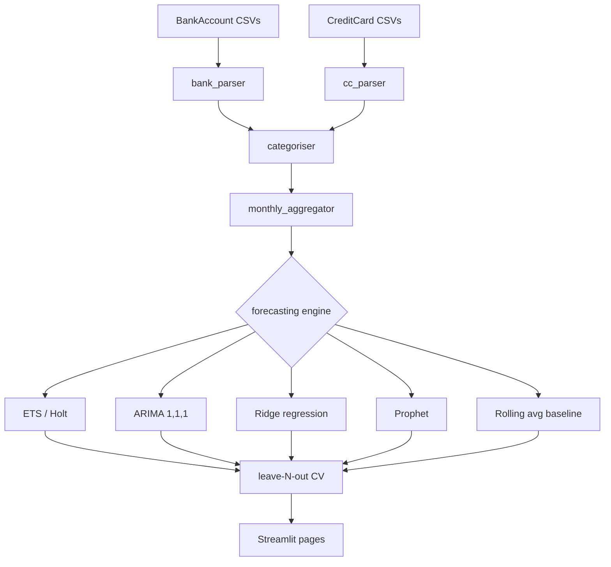

# Spending Pattern & Forecast Dashboard

Interactive Streamlit app for analysing **KBank** bank statement and credit card spending data for **Kanokphan** and **Yensa**, with multi-model time-series forecasting.

[](https://your-app-url.streamlit.app)

---

## Pages

| Page | Description |
|------|-------------|
| **Home** | Summary KPIs + side-by-side trend for both people |
| **Kanokphan** | Bank + CC combined analysis, heatmap, transaction table |
| **Yensa** | Bank + CC combined analysis, heatmap, transaction table |
| **Comparison** | Side-by-side metrics and full category comparison table |
| **Forecasting** | ETS · ARIMA · Ridge · Prophet — model selector, CI bands, CV metrics |

---

## Data folder structure

Place your exported KBank CSV files using **exactly** this path convention:

```
data/
├── Kanokphan/
│   ├── BankAccount/
│   │   ├── resultFile_20260324_175715.csv
│   │   └── resultFile_20260924_120000.csv   ← multiple files supported
│   └── CreditCard/
│       ├── credit_card_statement_20260324_153128.csv
│       └── credit_card_statement_20260924_153128.csv
└── Yensa/
    ├── BankAccount/
    │   └── resultFile_20260324_180748.csv
    └── CreditCard/
        └── credit_card_statement_20260324_180930.csv
```

Multiple CSV files per folder are **automatically concatenated and deduplicated**.

> ⚠️ Never commit real financial data to a public repository. The `.gitignore` excludes all CSVs inside `data/`.

You can also **upload files directly in the sidebar** of each person's page — no folder required.

---

## Supported CSV formats

### Bank statement (KBank savings account)
- Exported as `resultFile_YYYYMMDD_HHMMSS.csv`
- Thai encoding (UTF-8 with BOM)
- 9-row metadata header, transaction data from row 10
- Columns: Date (DD-MM-YY), Time, Description, Withdrawal, Deposit, Balance, Channel, Details

### Credit card statement (KBank)
- Exported as `credit_card_statement_YYYYMMDD_HHMMSS.csv`
- 5-row metadata header, transaction data from row 6
- Columns: Effective Date (DD/MM/YYYY), Posting Date, Transfer Name (Merchant), Transfer Amount

---

## Forecasting models

| Model | Min data points | Notes |
|-------|----------------|-------|
| Rolling average | 1 | Naive baseline — 3-month window |
| ETS (Holt's) | 2 | Trend-aware exponential smoothing |
| ARIMA(1,1,1) | 6 | Auto-regressive with differencing |
| Ridge regression | 4 | Time + lag features — interpretable coefficients |
| Prophet | 6 | Facebook Prophet — optional (see setup) |

Model quality is evaluated with **leave-N-out cross-validation** (hold out last 3 months), reporting MAE, RMSE, and MAPE.

---

## Local setup

```bash
# 1. Clone
git clone https://github.com/your-username/spending-forecast.git
cd spending-forecast

# 2. Install
pip install -r requirements.txt

# 3. Add your CSV files to data/
# (see folder structure above)

# 4. Run
streamlit run app.py
```

### Optional: install Prophet

Prophet requires a C++ compiler. On most systems:

```bash
pip install prophet
```

If it fails, the app still works — Prophet is silently skipped and the other four models run normally.

---

## Deploy to Streamlit Cloud

1. Fork this repository on GitHub
2. Go to [share.streamlit.io](https://share.streamlit.io) → **New app**
3. Select your fork · branch `main` · main file `app.py`
4. Click **Deploy**

To add your data files, either:
- Push the CSVs to `data/` in your **private** fork before deploying, or
- Use the **sidebar file uploader** on each page after deployment

---

## Project structure

```
spending-forecast/
├── app.py                          # Home page entry point
├── pages/
│   ├── 1_Kanokphan.py              # Kanokphan analysis
│   ├── 2_Yensa.py                  # Yensa analysis
│   ├── 3_Comparison.py             # Side-by-side comparison
│   └── 4_Forecasting.py            # Multi-model forecast
├── src/
│   ├── config.py                   # Constants, category keyword maps, colours
│   ├── parsers.py                  # KBank CSV parsers + upload handler
│   ├── categoriser.py              # Keyword-based transaction categoriser
│   ├── forecaster.py               # Rolling, ETS, ARIMA, Ridge, Prophet
│   └── charts.py                   # Plotly chart builders
├── data/
│   ├── Kanokphan/
│   │   ├── BankAccount/            # ← drop bank CSVs here
│   │   └── CreditCard/             # ← drop CC CSVs here
│   └── Yensa/
│       ├── BankAccount/
│       └── CreditCard/
├── .streamlit/
│   └── config.toml                 # Theme + server config
├── requirements.txt
└── .gitignore
```

---

## Architecture flowchart



---

## Category keyword mapping

Categories are assigned by matching transaction text against keyword lists in `src/config.py`. To add or adjust a category, edit the `CC_CATEGORIES` or `BANK_CATEGORIES` dictionaries — no code changes required elsewhere.

---

## License

MIT
